# UPF Second Sathar War Simulator User's Guide

**United Planetary Federation's Second Sathar War Simulator v0.0.17**

*Catalog No. Classification 1A — 583B00218S1*

---

## Table of Contents

- [Introduction](#introduction)
- [This Document](#this-document)
- [Installation](#installation)
- [Starting Up the Simulator](#starting-up-the-simulator)
- [The Main Window](#the-main-window)
  - [File Menu](#file-menu)
  - [Show Menu](#show-menu)
  - [Turn Menu](#turn-menu)
  - [Help Menu](#help-menu)
- [Starting a New Game](#starting-a-new-game)
  - [Setting up the UPF](#setting-up-the-upf)
  - [The Create Fleet Interface](#the-create-fleet-interface)
  - [Setting up the Sathar](#setting-up-the-sathar)
  - [Selecting Sathar retreat conditions](#selecting-sathar-retreat-conditions)
- [Playing the Second Sathar War Strategic Game](#playing-the-second-sathar-war-strategic-game)
  - [Viewing a star system](#viewing-a-star-system)
  - [Viewing a fleet](#viewing-a-fleet)
  - [Splitting a fleet](#splitting-a-fleet)
  - [Merging fleets](#merging-fleets)
  - [Moving a fleet](#moving-a-fleet)
    - [Normal movement](#normal-movement)
    - [Risk Jumps](#risk-jumps)
  - [Adding additional Sathar ships](#adding-additional-sathar-ships)
  - [Placing Strike Force Nova](#placing-strike-force-nova)
  - [Ending your turn](#ending-your-turn)
  - [Combat Resolution](#combat-resolution)
    - [Select Attacking Fleets](#select-attacking-fleets)
    - [Select Target Planet](#select-target-planet)
    - [Select Defending Fleets](#select-defending-fleets)
    - [Selecting the location](#selecting-the-location)
    - [Selecting combat resolution method](#selecting-combat-resolution-method)
    - [Using the tactical combat system](#using-the-tactical-combat-system)
    - [Entering results by hand](#entering-results-by-hand)
- [Tactical Combat](#tactical-combat)
  - [Setting up a new tactical game](#setting-up-a-new-tactical-game)
    - [Setting up a planet](#setting-up-a-planet)
    - [Setting up a station](#setting-up-a-station)
    - [Setting up a fleet](#setting-up-a-fleet)
  - [Moving your ships](#moving-your-ships)
  - [Selecting weapons](#selecting-weapons)
  - [Selecting defenses](#selecting-defenses)
  - [Selecting targets](#selecting-targets)
  - [Taking the shot](#taking-the-shot)
  - [Final tactical notes](#final-tactical-notes)

---

# Introduction
Welcome to the Second Sathar War Simulator.  Originally designed as a training tool for cadets at the Gollwin SpaceFleet Academy, it has now been released to the general public as well for the enjoyment of military enthusiasts and training of the merchant marine.  The Second Sathar War Simulator program implements (eventually) the full set of rules for the Second Sathar War strategic game defined in the Knight Hawks Campaign book (pp 55-60).  In addition, it contains (again, eventually) a complete implementation of the tactical combat system described in the UPF Tactical Operations Manual (Cat No. 562A11309T9).  This combat system will also be contained in the Star Frontiers Tactical Combat Simulator when it becomes available.

# This Document
This document contains a guide to the user interface of the Second Sathar War Simulator.  It describes the basic layout of the program as well as details on all the displays and dialog boxes that show up during the course of a simulation.  In no means is this document designed as a tactical or strategic training guide but simply as an interface guide to the simulator.

# Installation
Installing the simulation is quite simple, just unpack the zip file (if on a Windows system) or the gzipped tar file (if on a Unix/Linux system) in the directory where you want the simulation to reside.  The unpacking process will create a SSW directory with several subdirectories underneath it (bin, data & icons).   No additional setup is required unless you would like a desktop shortcut to the program.  In which case move to the bin directory and create a shortcut to the SSW.exe (or just SSW on Unix/Linux systems) and place it on your desktop.

# Starting Up the Simulator
Starting up the simulator is quite easy.  Simply execute the SSW (or SSW.exe) program in the bin directory where you installed it or click on the desktop icon you created during installation.  This will launch the program.
Upon startup the simulator will display the splash screen shown in figure 1 while it initializes the system.  The splash screen disappears after about three seconds leaving you with just the main simulation window.
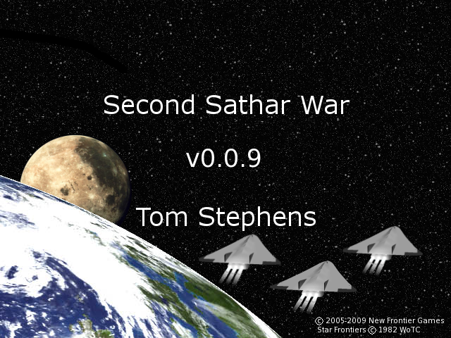
*Figure 1:   The splash screen for the Second Sathar War Simulator displayed at startup.*

# The Main Window
Once started you will be presented with a mostly empty main window as shown in figure 2.  Once a game is underway, the main window will be filled with a strategic map of the Frontier showing all the star systems and jump routes between those systems.  However, initially it is blank with only the menu bar at the top and the status bar at the bottom.
The main window contains four top level menus (File, Show, Turn and Help).  Each of these menus are described in the subsections below.

## File Menu
The File menu contains five options

- New – Selecting the New option creates a new game and launches a series of dialog boxes allowing you to set up the initial fleet compositions and positions of the simulation.  If you select this option while a game is loaded you will be prompted to save the current game first if desired.
- Open – Selecting the Open option bring up the Open File Dialog box allowing you to select a previously saved game and load it into the simulator to pick up where you left off.  If you select this option while a game is loaded you will be prompted to save the current game first if desired.
- Save – Selecting the Save option allows you to save the current game to disk for later recall.  It opens the Save File Dialog box allowing you to chose a name and location for the save file.  This option is not available at startup as no game is loaded.
- Close – Selecting the Close option closes the current game.  When selected, it prompts you to save the current game before closes.  If you wish to save, it behaves just like selecting the Save option.  After the game is saved or the save is declined, the current game is cleared returning you to the blank main screen.  This option is not available at startup as no game is loaded.
- Exit – Selecting this option exits the simulation program.  If you want to save your game before exiting be sure to select the Close or Save option first as this option immediately terminates the program.

## Show Menu
The Show Menu has three available options:

- Players – Selecting this option brings up a dialog box showing the player names.  Not very exciting at the moment.  In the future it may contain statistics on the player (number of ships, number of ships lost, number of systems controlled, etc).
- Sathar Retreat Conditions – This option is only available to the Sathar player.  It is always grayed out for the UPF player.  If selected, it shows a dialog box listing what the Sathar player's selected retreat condition is.
- Show Battle Board – This option launches the tactical battle map with a mini combat scenario.  Currently the scenario pits a UPF Frigate, 3 Assault Scouts and an Armed Station against a Sathar Destroyer and Light Cruiser.  It is mainly intended as a test bed as the tactical system is developed but may remain in the game for tutorial purposes.  How to interact with the tactical map is described in the Tactical Combat section of this document.

## Turn Menu
The turn Menu has four choices that activate various functionality that may be available during your turn:

- End Sathar Turn – This option is active during the Sathar turn and selecting it signifies that the Sathar turn is over.  It has the same effect as clicking on the big red “End Sathar Turn” button on the map during play.
- End UPF Turn – This option is active during the UPF turn and selecting it signifies that the UPF turn is over.  It has the same effect as clicking on the big red “End UPF Turn” button on the map during play.
- Place Strike Force Nova – This option is active during the UPF turn if Strike Force Nova has not yet been placed on the board.  Selecting this option randomly determines the starting location for SF Nova and places the fleet in the appropriate system on the map.
- Add Sathar Ships – This option is active during the Sathar turn if the Sathar player has ships in reserve that have not yet been placed on the board.  If selected it brings up a fleet construction dialog similar to the one used during game setup allowing the Sathar Player to place additional ships on the map.

## Help Menu
The Help menu currently only contains a single option.  Eventually there will be a full on-line help system here.

- About – Selecting this option brings up a small dialog about the program.

# Starting a New Game
To start a new game, simply select File->New from the menu bar in the main window.  If a game is already open, you will be given the option to save the current game before starting the new one.  When you start a new game, there is a bit of setup that needs to be done before play can begin.  The various setup steps are described in the sections below.

## Setting up the UPF
Most of the setup of the UPF is done automatically as the starting positions of most of the UPF ships are already known.  All of the stations, militia vessels and Task Force Cassidine and Task Force Prenglar are prepositioned by the game.  Strike Force Nova is assembled but not place on the map initially.  The UPF player has only to select the disposition of his unattached vessels.  This is done using the Create Fleet Interface as described in the following section.
Using the Create Fleet Interface, the unattached ships can be assembled into one or more small fleets (with as few as one ship) and placed in various systems around the Frontier or added to the existing fleets.  Ships added to Strike Force Nova start off the map and will enter when the Strike Force is placed in the game.
The UPF player may not remove ships from the prepositioned fleets (TF Cassidine, TF Prenglar and SF Nova) although they may add ships to those fleets.  Also, they cannot change the starting location of the two Task Forces.
Once the UPF player has assigned all the unattached ships to new or existing fleets, the 'Done' button will illuminate, clicking on this turns control over to the Sathar player to create his fleets.

## The Create Fleet Interface
The Create Fleet Interface is shown in figure 3.  The interface has areas to select ships to add to or remove from fleets, select the fleet to modify, set the name or starting system for the fleet and commit the changes.  Each of the areas numbered in the figure will be described below

- Unattached Ship Area – This area contains a list of all the ships currently unassigned to a fleet. Selecting one or more ships in this area activates the Add button (6).  If there are more ships than can fit in the visible area, a scrollbar appears on the right hand side of the area allowing you to scroll through the full list.  This area remains inactive until a fleet selection is made (area 2).
- Fleet Selection Box – This drop down box allows the selection of the fleet to which you want to a dd ships.  Clicking on it brings up the list show all the existing fleets as well as an option for a New Fleet which has been selected in this example.  When the Create Fleet dialog first appears, this is the only active field.
- Fleet Name – When creating a new fleet, this field activates allowing you to type in the name you want your new fleet to have.  When selecting an existing fleet, the area remains inactive.
- Home System Selection – When creating a new fleet, you must specify which star system you want the fleet to begin in.  Selecting this field brings up a list of all the systems in the Frontier for you to choose from.
- Fleet Ships Area – This area shows all the ships that have been assigned to the fleet.  If there are more ships than can fit in the visible area, a scrollbar appears on the right hand side of the area allowing you to scroll through the full list.  If you are working with an existing fleet, the ships that are a permanent part of that fleet cannot be selected in this box.  However, ships that have been added and not committed to the fleet by selecting the Update Fleet button (8) can be selected.  Selecting these ships activates the Remove button (7).
- Add button – This button is only active when ships are selected in the Unattached Ship Area (1).  Selecting this button once active moves all of the selected ships from the Unattached Ship Area (1) to the Fleet Ships area (5)
- Remove button – This button is only active when eligible ships are selected in the Fleet Ships area (5).  Selecting this button removes the selected ships from the Fleet Ships area (5) and places them back in the Unattached Ships area (1).
- Update Fleet button – This button activates once a ship has been added to the selected fleet.  Once you are satisfied with your fleet composition, selecting this button will commit the changes you have made to the fleet.  This will store the updates and reset the dialog box to its initial state.  Clicking on this button performs some checks on the fleet and makes sure you have selected a home system (4) for the fleet, given it a name (3) if it is a new fleet and that if the fleet contains fighters, there is at least one assault carrier for every eight fighters.  Note:  Currently the interface does not allow removal of ships once they have been added to a specific fleet so be sure you want to add the ships to the fleet in question before you click on the 'Update Fleet' button.
- Done button – Once all your ships have been assigned to fleets and placed on the map (or added to Strike Force Nova) the Done button will activate.  Clicking on it will complete the UPF setup.
There is also a Cancel button on the interface.  Clicking on this will abort the create of a new game and return you to the blank main window.  Once the UPF are set up, it is time for the Sathar to set up their fleets.

## Setting up the Sathar
The interface for setting up the Sathar fleets is the same as the one used for setting up the UPF unattached ships.  The initial conditions and rules are slightly different, however.

- Initially, the Sathar have no fleets so your only option in the select fleet box is 'New Fleet'.
- The Sathar do not have to place all their ships on the board to start the game.  They may hold some in reserve for a later time.
- Only the five Sathar Start Circles are give as system locations for the Sathar fleets.
Other than that, the interface functions identically to the UPF Create Fleet dialog including the fact that once you have hit the 'Update Fleet' button, those changes cannot be undone.
The 'Done' button only illuminates to complete the Sathar setup when the following conditions have been met (as described on page 57 of the KH Campaign Book):

- The Sathar have placed at least 20 ships, excluding fighters, on the map
- The ships are distributed between two or more fleets.
- No single fleet has more than half the ships on the map.
Selecting the 'Done' button completes the Sathar Fleet setup and moves you into the final step of game creation, selecting the Sathar retreat conditions.

## Selecting Sathar retreat conditions
The Sathar have five possible retreat conditions to choose from.  This condition represents part of what the UPF have to do to achieve victory (the other part is keeping their stations alive).  It is chosen at the beginning of the simulation and cannot be changed.  Only the Sathar player can see the selected condition, it is hidden from the UPF player.  Figure 4 Shows the dialog which allows the Sathar player to choose the retreat conditions.  The possible choices are:

*Figure 4: Sathar Retreat Condition selection dialog.  The Sathar player choses what represents defeat for this game.*

- The Sathar have lost two Assault Carriers
- The Sathar have lost five Heavy Cruisers.
- The Sathar have lost 40 ships, including fighters.
- A tenday passes without the Sathar destroying at least two space stations.
- At the end of any tenday, the Sathar have lost more ships in combat than the UPF.  Fighters and Militia ships are not counted toward this total.
Once the Sathar player has selected his retreat conditions, game setup is complete and you are ready to play the game.

# Playing the Second Sathar War Strategic Game
Once setup is complete you are ready to play and presented with the main strategic map.  This is simply a map of the Frontier with all the start system and jump routes marked as seen in figure 5.  This simulation uses the actual Frontier map instead of the Frontier Deployment Map (FDM) used in the boardgame to help simplifiy the view.  The areas numbered in the figure so different parts of the game map.  Each is described in the sections below.

- Day counters – This region of the map simply keeps track of the number of days (turns) that have passed since the beginning of the game.  The 'DAY' counter counts off the individual days and the 'TENDAY' counter is incremented each time the day counter wraps around back to zero.
- End Turn Button – This is an active region of the map and shows which side is currently active. In the figure it is the Sathar's turn so the button is red.  On the UPF player's turn it turns to blue and holds the text “End UPF Turn”.  Clicking on this button ends the respective player's turn for that day.  It has the same effect as selecting the similarly labeled menu items in the Turn menu.
- Sathar Star Circles – The five red circles on the map are the Sathar Start Circles and represent the locations where the Sathar player can start his ships on the map.  These do not represent actual star systems but rather the point within the systems they are connected to where the Sathar ships exit their void jump.  These circles are active regions on the map.
*Figure 5: The main strategic game map.  This map shows the location of all fleets in the game as well as the turn count.  The numbered areas are described in the text.*
- UPF Star Systems – The blue circles on the map represent the various inhabited star systems of the UPF.  Each is labeled with the name of the system.  The star system circles are active regions of the map and double clicking on them will bring up a dialog showing all of the fleets and stations associated with that system (see Viewing a Star System below).
- Sathar Only Jump Route – The lines connection the Sathar Start Circles to the various start systems are jump routes known only to the Sathar.  The UPF forces cannot travel on these routes.
- Standard Jump Routes – The blue lines connecting the UPF star systems are jump routes know to both the UPF and Sathar.  Either player may travel along these routes and these represent the only paths between the various star systems.
- UPF Fleet Marker – Each UPF fleet is marked by a UPF fleet symbol.  This marker represents a fleet not currently in transit and shows the marker on the system circle.
- Militia Fleet Marker – The various system militias are represented by a ship counter corresponding to the flag ship of the militia.  Each of the militias of the planetary systems have their own unique color.
- Transiting Militia Fleet Marker – Fleets in transit between systems are shown on the jump routes connecting the two systems they are traveling between.  Their distance along the route is proportional to the distance traveled (and time remaining) in the transit.  All fleet and ship markers on jump routes are active regions of the map and double clicking on them will show the status of the fleet in question (see Viewing a fleet below).
- Transiting Sathar Fleet Marker – All Sathar fleets are marked using this fleet marker.  This fleet is in transit from the Sathar Start Circle #4 into the Kisk-Kar system.
- Transiting UPF Fleet – This shows a UPF fleet in transit from Cassidine to Drammune. Otherwise it is similar to the Transiting Militia Fleet Marker.
As described in the numbered items above, certain regions of the map (End turn button, star systems and fleets in transit) are active.  Double clicking on these areas allows you to interact with the various components of the game.  These interactions are described in the sections below

## Viewing a star system
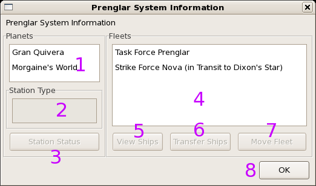
*Figure 6: The System Information Dialog.  This window shows the various planets, stations and fleets in the selected start systems.  Numbered areas are described in the text.*

Double clicking on any star system or Sathar Start Circle on the map brings up the System Information dialog as shown in figure 6.  The dialog shows the planets and ships in the system.  The various parts of the dialog box are described below.

- Planet List – This box shows all the planets in the star system.  For a Sathar Start Circle, this field is blank and inactive.  For all of the UPF systems, there is at least one planet here.  Selecting a planet will display its station, if any, in the Station Type box.
- Station Type – Once you've selected a planet, this box activates and shows the name of the station, if any, orbiting the planet.  If no station is present around that planet, the box remains empty and inactive.
- Station Status button – This button brings up a dialog showing the statistics (HP, weapons, etc) of the station displayed in the Station Type box.  Note:  This feature is currently not implemented.
- Fleet List – This box lists all the fleets currently located in the system.  This includes all UPF, militia or Sathar fleets whether they are stopped in the system or in transit into or out of the system.  When in transit, a ship is considered to be in the system if it has traveled less than half of the time needed to make the transit if leaving the system or more than half the total travel time if entering the system.  Fleet names in this box are annotated with their travel status showing their destination and travel speed (normal – which is unmarked or Risk Jump 2 or 3 marked as RJ2 or RJ3 respectively).
- View Ships button – This button is active whenever a fleet is selected, whether you control it or not.  Clicking on this button brings up the View Fleet dialog which is described in the Viewing a fleet section below.  You can look at the contents of any fleet on the board whether you control it or not.
- Transfer Ships button – If you want to move ships between fleets, select the fleet you want to move ships to/from.  If it is yours to control, the Transfer Ships button will activate.  Clicking on this button brings up the Transfer Ships dialog which is described in the Splitting a fleet and Merging fleets sections below
- Move Fleet button – After selecting a fleet, this button will activate if the fleet selected is yours to command.   Clicking on the button will open up the Fleet Movement dialog described in the Moving a fleet section below.  You can select this button even for fleets that already have travel orders and changes those orders.
- OK button – When you are done interacting with this system simply click on the OK button.  This will close the dialog and return you to the main game window.  This button is always active.

## Viewing a fleet
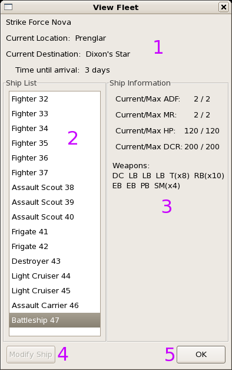
*Figure 7: The View Fleet dialog.  This particular example shows SF Nova in route from Prenglar to Dixon's Star.  The numbered areas are described in the text.*

You can arrive at the View Fleet dialog in one of two ways: from the System Information dialog by selecting a fleet and clicking the View Fleet button, or by simply double clicking on a fleet in transit on the main map.  Either way, you will be presented with a View Fleet dialog as shown in figure 7.  This dialog shows the location of the fleet, its destination and travel time if in transit, the ships in the fleet and allows you to see the statistics of the ships if desired.  The regions numbered in the figure are described below.

- Name, Location and Status – This part of the dialog shows at least the name of the fleet and the system it is current in.  If the fleet is in transit, the destination lists the system it is heading to and the time (in days) until it arrives is displayed.  If not in transit, these last two fields list 'none' and 'N/A' respectively.
- Fleet Composition – This box is always active and lists all of the ships currently assigned to the selected fleet.  As a ship is selected, its information is shown in the Ship Information section of the dialog.  Only one ship can be selected at a time.
- Ship Information – This portion of the dialog shows the statistics of the selected ship and is updated every time a new ship is selected.  It shows the current and maximum HP, ADF, MR, DCR of the ship as well as the ship's weapons and ammo status.  Note:  This part of the dialog will continue to evolve as the information tracked about each ship changes.
- Modify Ship button – This button allows you to update and change statistics on the selected ships such as changing its name or updating other items.  Note:  This feature is not currently implemented.
- OK button – This button is always active.  When you are done looking at the fleet simply click on this button.  It closes the dialog and returns control to the previous window.

## Splitting a fleet
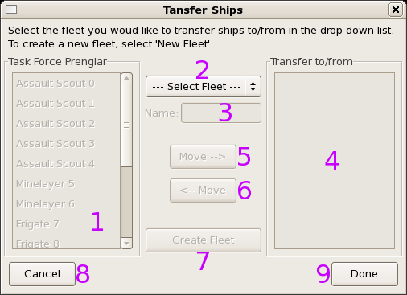
*Figure 8: Transfer Ships dialog.  This dialog is used for splitting and merging fleets.  The numbered controls are described in the text.*

To split a fleet select the fleet in the fleet list of the system information dialog and click on the Transfer Ships button.  This will bring up the Transfer Ships dialog shown in figure 8.  The numbered portions of the dialog are described in the following text.  This dialog can be used to split a fleet, move ships between two existing fleets or combine two fleets into a single fleet.

- Ships of current fleet – This box lists all the ships assigned to the current (origin) fleet.  Once it is active you can select one or more ships to move to the destination fleet.
- Destination Fleet selection – This drop-down box lists all other fleets in the system that can receive ships from the selected fleet as well as an entry allowing you to create a new fleet.  Besides the Cancel and Done buttons, this is the only active field when the dialog first appears.  Simply select the second fleet you want to work with or “New Fleet” to create a new one.
- Fleet Name field – When creating a new fleet, this field becomes active allowing you to give the fleet a unique name.  If selecting an existing fleet, this field stays inactive.
- Destination fleet ships – This box lists all ships assigned to the destination fleet.  For a new fleet, this box is initially empty.  If the selected destination fleet is an already existing fleet, this box will be populated with the ships currently assigned to that fleet.  This allows you to move various ships back and forth between existing fleets as well a creating new ones.  You may select one or more ships at a time to move.
- Move to destination fleet button – Selecting this button moves all highlighted ships in the origin fleet list into the destination fleet list.
- Move to origin fleet button – Selecting this button moves all ships selected in the Destination fleet ships area to the origin fleet list.
- Create Fleet button – Once you are satisfied with the composition of the new fleet (or changes to the existing ones) click on this button to record the changes.  The new fleet will be created and the dialog box will return to its original state with the new fleet added to the Destination Fleet selection field.  Changes will not be saved to the main game until the Done button is clicked.
- Cancel Button – This button is always active.  Clicking on the cancel button closes the dialog without saving any changes to the fleets.
- Done Button – This button is always active.  Clicking on it closes the dialog and updates all fleets with the specified changes.

## Merging fleets
To merge fleets you use the same dialog used to split a fleet.  In this case first select one of the fleets you want to join in the System Information dialog and click on the Transfer Ships button.  In the Transfer Ships dialog, select the second fleet that you want to join into the first one.  Next select all the ships from one of the fleets and move them to the other.  Click on the Create Fleet button to commit the changes and then the Done button to close the dialog.  The empty fleet will be removed from the game.

## Moving a fleet
When you want to send a fleet from it's current location to a new system simply select the fleet in the System Information dialog and click on the Move Fleet button.  This will bring up the Move Fleet dialog as shown in figure 9.  This dialog allows you to select the fleet's destination and the travel speed you wish the fleet you use.  The various components of the dialog box are described below.

- Destination List – This box lists all of the possible destination systems the selected fleet can reach from its current system.  Simply select the system you would like to travel to.
- Travel time – Once a destination has been selected, this region shows how long it will take to get to the selected system traveling at the various jump speeds.  Traveling at the standard rate involves no risk and the travel time is equal to the distance between the systems in light years.  Risk jumping speeds up travel but carries a chance that they ships will not successfully make the jump and be lost from the game.

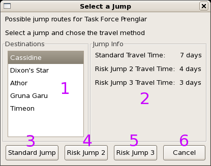
*Figure 9: Fleet Movement Dialog.  This dialog allows you to select a destination and travel speed for the fleet.  Numbered items are described in the text.*

- Standard Jump button – If you want to travel at the standard rate, select this button to start the fleet on its journey.  In order for the fleet to move, this or one of the Risk Jump buttons must be selected.  See the Normal Movement section below for more details.
- Risk Jump 2 Button – If you want the fleet to travel at the Risk Jump 2 speed, select this button.  This cuts the travel time roughly in half but carries a 5-30% chance of losing the fleet depending on the type and composition of the fleet.  In order to use this speed, all ships in the fleet must have an ADF of at least 2 (i.e. no Minelayers).  See the Risk Jumps section below for more details on risk jumping.
- Risk Jump 3 Button – Selecting this launches the fleet at the Risk Jump 3 speed.  This cuts travel time to one half to one third of the standard time depending on the length of the jump (it has a greater effect on longer jumps) but increase the chance of losing the fleet to 10-50% depending on the fleet type and composition.  This option is only available to fleets whose ships all have an ADF of 3 or higher (i.e. nothing larger than a Light Cruiser and no Minelayers). See the Risk Jumps section below for more details on risk jumping.
- Cancel Button – If you change your mind and don't want to move the fleet, simply click on the Cancel  button to return to the previous window.

### Normal movement
Normally fleets travel at a rate of one light year per day.  Thus to move from Prenglar to Cassidine, a distance of five light years, requires five days of travel time.  Traveling at the normal movement rate carries no risk.  This is the standard rate that the ships are designed to travel at and all ships traveling at this rate are guaranteed to arrive at their destination.  Under standard movement the ships are assumed to be under a constant 1g of acceleration throughout their travel.

### Risk Jumps
Risk jumps, or risk jumping, occurs when ships travel at a faster than normal rate.  There are two different rates of risk jumping, risk jump 2 and risk jump 3.  The value represents the rate of acceleration (in multiples of 1 g) that the ships are under during travel.  In order to use this rate of travel, all ships in the fleet must have an ADF equal to the risk jump number or higher.  Traveling at these higher speeds reduces the travel time for the ships to move between systems by roughly the factor of their acceleration rate.  However, this is not completely true due to the mechanics of the jump process and on shorter jump routes, the risk jump 2 and risk jump 3 travel times may be identical.
This increased speed does not come without risks, however.  Because of their higher rate of travel, the ships' astrogators don't have enough time to properly compute the jump calculations and therefore a chance exists that they will make a mistake causing the fleet to “misjump” and not arrive at its destination.  For the purposes of the game, this means the fleet is lost from the game and considered destroyed.
The chance of misjumping depends on the affiliation of the ships (UPF, Sathar or Milita), the ship type (Battleship or other) and the travel speed.  The risk jump success probabilities are summarized in table 1 (below, taken from the KH campaign book).  The success chance for a given fleet is based on the best ship in the fleet.
**Table 1: Risk jump success probabilities.  This table lists the probabilities that a fleet will successfully make a risk jump.**

|  | Risk Jump 2 | Risk Jump 3 |
| --- | --- | --- |
| UPF Battleship | 95% | N/A |
| Standard UPF or Sathar vessel | 90% | 70% |
| Militia Vessel | 70% | 50% |

## Adding additional Sathar ships
Once the game has begun, the Sathar player has the option of bringing any ships that they did not place at the beginning of the game into play.  This can only be done the Sathar player's turn and may not be done on the first turn immediately once the game has started (the initial setup represents placement on this turn).
In order to place additional ships, select Turn->Add Sathar Ships from the game menu.  This will bring up the Create Fleet interface just as when placing ships initially.  The same rules apply when adding new ships to the game now as did during the initial setup with the exception that there is not a minimum number of ships required to be placed on the board.  The restriction that no more than half of the ships place can start in the same location still applies, however.
Simply use the interface as described above to construct your fleets and place them on the map.  Once done, the fleets can move normally.

## Placing Strike Force Nova
Strike Force Nova begins the game off the map.  This fleets is constantly on patrol and moves throughout the Frontier and neither side knows where it is at initially.  On the UPF player's turn, they have the option of placing SF Nova on the map.  To do so, select Turn->Place Strike Force Nova from the main menu.  This will cause the fleet to be placed on the map at a random location determined by table 2.  Once placed, SF Nova can be moved and interacted with normally.
**Table 2: Strike Force Nova Start Table — This table gives the probabilities that Strike Force Nova will appear in the specified systems when placed on the map.**

| Start System | Probability |
| --- | --- |
| Prenglar | 30% |
| Cassidine | 10% |
| Truane's Star | 10% |
| White Light | 10% |
| Fromeltar | 10% |
| Kizk-Kar | 10% |
| K'aken-Kar | 10% |
| Drammune | 10% |

## Ending your turn
Once you are satisfied with all of your fleet's movement orders, your turn is done.  Simply click on the end turn button under the day counter on the main map or select the appropriate End Turn option in the Turn menu on the main menu.
If the Sathar are ending their, turn it moves to the UPF turn.  Once the UPF have ended their turn, the simulator checks to see if UPF and Sathar fleets occupy the same star system anywhere in the Frontier.  If not, it is now the Sathar's turn again.  If there are systems containing fleets from both sides, combat can occur.

## Combat Resolution
When the possibility of combat exists, you will be presented with a series of dialog boxes allowing you to set up the combat in each system where it can occur.  The Sathar are the attackers and always have the first option to engage in combat.  In any system where the Sathar decline combat, the UPF have the option to attack the Sathar ships if they desire.  The following subsections describe the logic flow and interactions with the various dialog boxes.

### Select Attacking Fleets
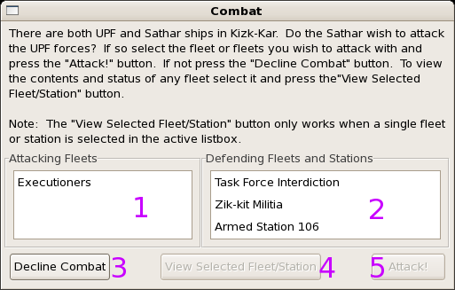
*Figure 10: Select Attacking Fleet Dialog.  This allows the attacking player to preview the fleets in the system and select their fleets that they want to use to engage.*

The first dialog that appears is the Select Attacking Fleets dialog as shown in figure 10.  This dialog allows the attacking player to look at the composition of all fleets in the system and chose those of their fleets (if there is more than one in the system) that they want to use in the combat.

- Attacking fleet list – This area lists all of the fleets in the system owned by the attacking player (typically the Sathar).  Selecting a fleet in this area activates the View Fleet button.  Selecting one or more fleets activates the Attack! button.  In order to initiate an attack, the attacking player should select all of the fleets he wants to attack with in this box and then click on the Attack! button to start the attack.
- Defending fleet list – This area lists all of the fleets and station in the system controlled by the defending player (typically the UPF player).  Selecting a fleet activates the View Fleet button.
- Decline Combat button – If the Sathar player does not want to engage in this system, they can click on the Decline Combat button.  This will present a dialog indicating that the UPF now have the option to attack and then the dialog in figure 10 is presented again but this time the UPF player's fleets are in the Attacking fleet list and the Sathar player's fleet(s) are in the Defending fleet list.
- View Fleet button – This button activates when a fleet is selected in either the Attacking Fleets or Defending Fleets list.  Clicking this button opens up the View Fleet dialog (described in the View Fleet section above).  This allows the players to look at the composition of the various fleets that could be involved in the combat.
- Attack! button – This button only activates when at least one fleet in the Attacking fleet list has been selected.  Clicking this button commits the selected fleets in the Attacking fleet list to the combat, closes the dialog box and opens the Select Defending Fleet dialog.

### Select Target Planet
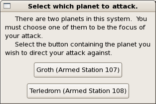
*Figure 11: Planetary Target dialog - Allows the attacking Sathar player to pick which planet he wants to attack.*

If the system contains more than one planet, the attacking player has the option to declare which of the planets it wishes to attack.  This option is only available if the attacking player is the Sathar.  If the UPF are initiating the attack, they have to chase the Sathar out into deep space so there will be no planet around.  If selecting a planet is an option, the Planetary Target dialog will be displayed as shown in figure 11.  Each planet will have the name of the station, if any, next to in the button.  Simply select the button of the system you want to attack.

### Select Defending Fleets
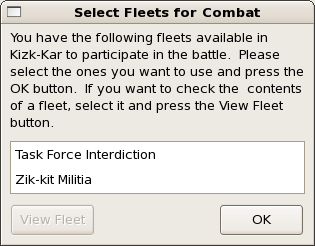
*Figure 12: Select Defending Fleets dialog - This dialog allows the defending player to select which of their fleets will participate in the combat.*

Once the attacker has selected his fleets (and the planet he wants to direct his attack against if there is a choice), the defender is presented with a list of their fleets in the system (as shown in figure 12) and given the option to select the fleets they wish to use in the defense.  When only one fleet is selected, the View Fleet button activates.  Clicking this button bring up the View Fleet dialog for that fleet allowing the defending player to look at the fleet composition (as described in the View Fleet section above).
The defending player can select any or all of the fleets in the box. Once the fleets are selected which the defending player wants to use in the combat, clicking on the OK button moves on to the next stage of combat set up.

### Selecting the location
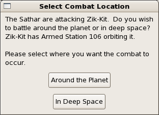
*Figure 13: Combat Location dialog - Allows the defending UPF player to select the combat location.*

If the defending player is the UPF, they have the option to either engage the Sathar around the planet (with its station if present) or intercept them in deep space before they reach the space near the planet.  After the defending fleets have been selected, the Combat Location dialog (figure 13) is presented.  Simply click on the button corresponding to the location where the combat should occur.  Once the location of the combat has been decided, it is time to resolve combat.

### Selecting combat resolution method
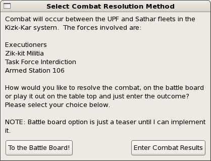
*Figure 14: Combat Resolution Method dialog - This dialog shows all the fleets and station involved in the battle and allows the user to select the method of determining the combat results.*

After all the combat setup is done, you have two choices for resolving combat which are presented in the Combat Resolution Method dialog as shown in figure 14.  In addition to giving the combat resolution method choices, this dialog also lists all the fleets and station, if present, that will be involved in the battle.
The first option is to use the tactical combat system built into the simulation.  The tactical combat system implements the combat rules from the UPF Tactical Operations Manual and is the preferred method of combat resolution.  To select this option, click on the “To the Battle Board!” button in the lower left of the dialog box.
Your second option is to play out the combat on a tabletop board or otherwise resolve the battle outside of the simulation.  In this option you must then enter the combat results by hand so that the game can be updated.  This option is selected by clicking on the “Enter Combat Results” button in the lower right of the dialog box.

#### Using the tactical combat system
If you choose to use the tactical combat system, the game immediately opens up the battle board which allows you to set up and play out the tactical combat for this battle.  Once done, it returns you to the main battle board to either continue the strategic portion of the game or set up combat in another system if there are more combat opportunities for the current round.  The setup and play of tactical combat system is described in detail in the Tactical Combat section below.

#### Entering results by hand
If you chose to enter the combat results by hand, you are presented with the Battle Results dialog.  This dialog lists all of the fleets involved in the battle.  Select a fleet and choose the outcome for that fleet from the result selector, then click the button to record it.  Repeat for each fleet involved in the battle and click Done when all results have been entered.

# Tactical Combat
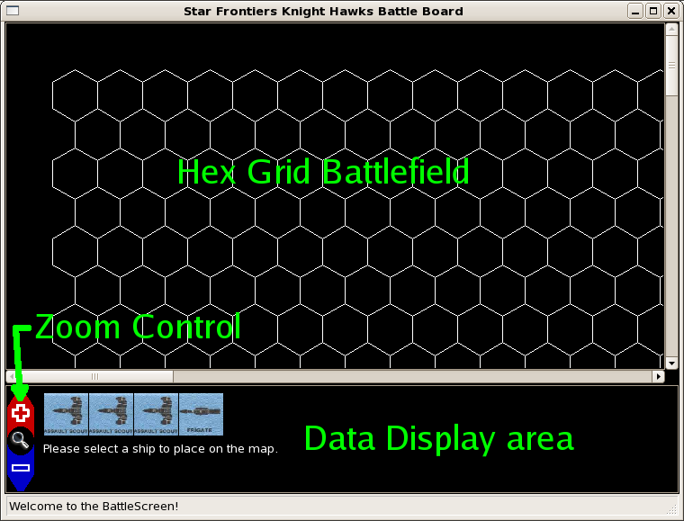
*Figure 15: Sample initial tactical combat screen.  The upper panel is the battle field map and the lower panel is the data display area.*

You get to the tactical combat map either by selecting Show Battle Board from the Show Menu on the main screen or during a combat encounter in the strategic game by clicking "To the Battle Board!" in the Combat Resolution Method dialog.  In either case you are presented with a screen similar to the one shown in figure 15.
The screen is divided into two sections.  The upper section is the battlefield.  This portion of the screen is a large scrollable canvas that holds the hex grid map the combat is played out on.  It will show all of the ships involved in the combat the planet and station if present and the movement of each ship each turn.  In addition it displays the effective range of the currently selected weapon on the currently selected ship during the combat phases of the game.
The bottom window is the data display window.  The contents displayed here change throughout the course of the tactical game setup and play depending on the current phase of the game.  This display shows the ships to be placed during setup, controls for setting their initial speed, ship status displays for the selected ships and controls for ending the various phases of the tactical combat game.
A permanent feature of the data display panel is the zoom control.  This control is always visible and active and allows you to zoom in or out on the battlefield.  Clicking on the red “+” arrow zooms in on the hex grid and selecting the blue “-” arrow zooms out.
The entire battle screen window can be resized as desired based on your screen resolution.  The data display area always remains a constant height regardless of window size and the battlefield window grows to fill the rest of the space.  The initial size of the window is 800x600 pixels in size.

## Setting up a new tactical game
When you enter the tactical game, the first thing you have to do is set up the battlefield with the various fleets as well as a possible planet and station.  The order of setup is as follows:

- Pick location for planet if one is in the scenario
- Place a station around the planet if there is a station in the scenario
- Place the defending ships on the map
- Place the attacking ships on the map.
Once the ships are placed, the game moves into the combat sequence defined in the Advanced Combat section of the UPF Tactical Manual (will reproduce here eventually).

### Setting up a planet
If you are playing a game in a system where there is a planet, the first thing you will see in the display area is a selection of planet icons for you to choose from as shown in figure 16.  If there is no planet involved in the battle, you will proceed directly to setting up your fleets.
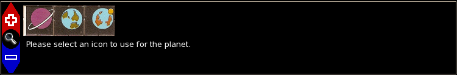
*Figure 16: Data Display area showing planet icon choices.*
Upon selecting the planet icon, instructions will appear directing you to select the hex location for the planet on the battle map (figure 17).  Click on the location where you'd like the planet to be and it will be drawn on the map.
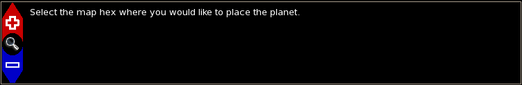
*Figure 17: Data Display area directing you to place your planet on the battle map.*
Note:  Currently planet selection location is final so be sure you are where you want to be before you click on the map.

### Setting up a station
After setting up your planet, you get the opportunity to set up your station if there is one in the scenario.  If not, you proceed directly to setting up your fleets.  If a station is present, the data display area changes to the text shown in figure 18 immediately upon placing the planet directing you to select the location of the station.
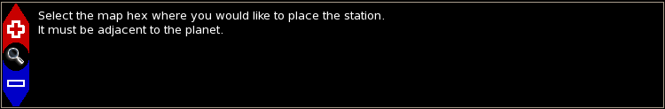
*Figure 18: Data Display area direction you to place your station on the map.*
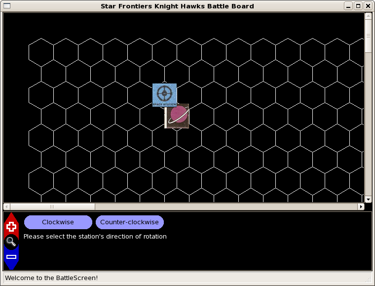
*Figure 19: Battle screen after placing the planet and the station.  The data display area presents a choice to select the orbital direction of the station.*

To place your station simply click on one of the six hexes around the planet.  Clicking anywhere else has no effect.  Once you have clicked on a location, the station appears on the map and the data display area changes to give you two buttons labeled 'clockwise' and 'counterclockwise' as shown in figure 19.  Click on the button to pick the orbital direction of the station around the planet.  Once you do, the station icon will be oriented so that the left side (if you were looking at it with the name right side up) is pointed in the direction of travel.  So if you selected clockwise, the station name will be on the side opposite the planet and if you selected counterclockwise, the station name will be next to the planet.  Once your station is set up, it is time to set up your fleets.

### Setting up a fleet
Setting up a fleet is the same regardless of the side you are playing.  Initially, the data display area shows a collection of icons representing your ships as shown in figure 20.
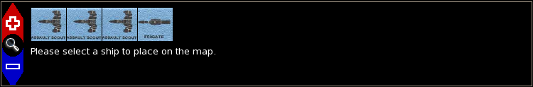
*Figure 20: Initial data display screen when setting up your fleet.  In this case it shows four UPF ships to be placed on the board.*
Placing a ship consists of four steps:

- Select the ship you want to place – To pick a ship place a ship on the map, you simply click on the ship icon for that ship.
- Select the ship's location on the hex grid - Once you have selected a ship the display screen changes to the one shown in figure 21.  To place the ship, simply click on the hex on the battle map where you want the ship to be located.
- *Figure 21: Data display screen shown when placing a ship and selecting its initial heading.*
- Choose the ship's initial heading – Once you select the hex location, the ship's icon is placed on the map and you have to select its initial heading.  Simply move the mouse in the direction you want the ship to face and the ship's nose will follow the mouse.  When it is pointed in the direction you want, click the left mouse button to set the heading.
- Set the ship's initial speed – Once the position and heading have been determined, you need to choose the ships initial speed.  Set the speed in the input box that appears in the data display (figure 22) area to the desired value and click on the “Set Speed” button.  That sets the ship's speed and returns you to step 1.
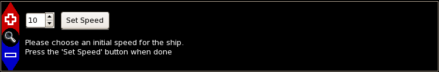
*Figure 22: Data display area for selecting the ship's inital speed.  Use the control to select the speed and click on the "Set Speed" button to save the value.*
This cycle continues allowing you to select another ship until the last ship is placed.  At that point control either shifts to the other player allowing them to place their ships (if you were the defender) or the combat phases begin with the attacker having the first move.
Note:  At the current time all set-up decisions are final.  There is no way to go back and move things around or change speeds before passing control onto the next phase.

## Moving your ships
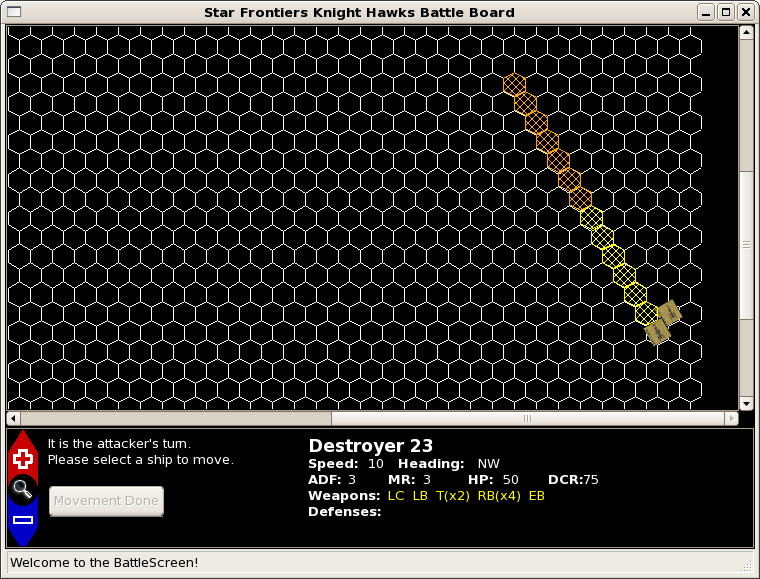
*Figure 23: Battle screen after selecting a ship to move.  The ship statistics are displayed in the data display area and the hexes it can move into based on its current heading and speed are highlighted.*

On your movement turn, the game provides guidance for your ships' legal moves.  To move a ship, simply click on the ship you wish to move.  If you have more than one ship in a given hex, clicking multiple times in succession will cycle through all the ships in that hex.  When you select a ship the data display area will be updated to show the selected ships vital statistics (Name, HP, ADF, MR, weapons, etc) and the battle grid will be updated to show the possible movement options based on its current speed, heading, ADF, MR and any already selected moves as shown in figure 23.
The hexes are highlighted in two different colors.  The yellow hexes represent the distance the ship has to travel based on it's ADF and speed from last turn.  The orange hexes represent the possible ending hexes, either speeding up or slowing down, based on the ship's ADF and speed.  You must eventually end your movement in an orange hex.
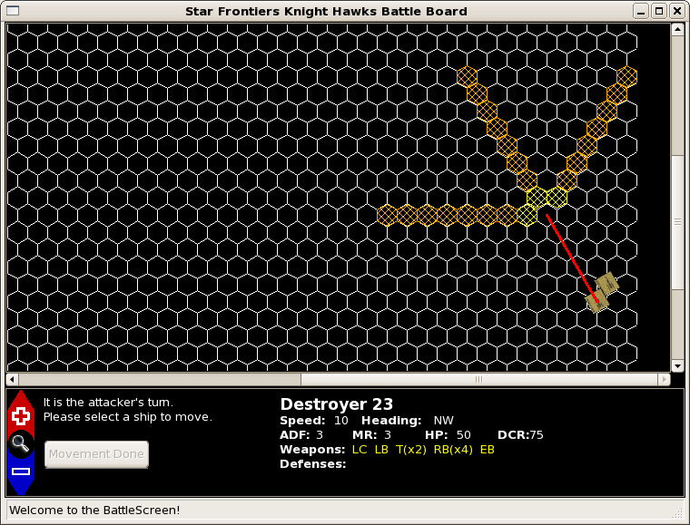
*Figure 24: Battle screen after picking some initial movement for your ship.  The traversed path is marked by the red line and the possible remaining moves (taking a possible turn into account) are highlighted by the shaded hexes.*

To pick the path for your ship simply click on one of the highlighted hexes.  When you do so, the hexes between your current ship location and the selected hex will be connected by a red line representing the selected move and the hexes on the map will be reshaded based on your possible moves from that point (see figure 24).  If you change your mind about your move, simply click in any hex containing the red line and your selected movement will be backed up to that point and the hexes reshaded based on that location.
You do not need to move all of the necessary hexes before moving on to a new ship.  You may freely move between all of your ships moving them as little or as much as you like.  When you do, the selected path for the ship changes from red to gray.  All ships you have moved are so marked so you can see what movement orders you have issued.
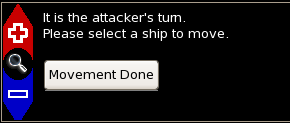
*Figure 25: Activated 'Movement Done' button after moving all your ships the minimum distance required by their speed and ADF.*

However, you must eventually get all of your ships into the orange hex zones to move on.  Once you have moved all of your ships into their hex areas marked with orange hexes, the Movement Done button in the data display area illuminates (figure 25).  Once you are satisfied with your movement orders, select this button.  Your ships will be moved to the ends of the movement lines and it is now time for defensive fire.  The movement lines will stay on the board so that the opposing player can see where you traveled during the last turn.
Note:  There is currently one known issue with movement:

- Ships can't stop.  If you try to not move a ship or have a ship with speed zero, the game may behave unexpectedly.  This was discovered by BD_Cerridwen during play-testing.

## Selecting weapons
To select a weapon, you start by selecting the ship that wants to fire.  As always, the information about the selected ship is displayed in the data display area.  During your combat phases, the weapon names are color coded and active.  The color's have the following meanings:

- white – unable to fire this phase (either out of ammo or MPO during defensive fire)
- yellow – ready to fire, no target assigned
- green – ready to fire, target selected
- red – damaged, unable to fire
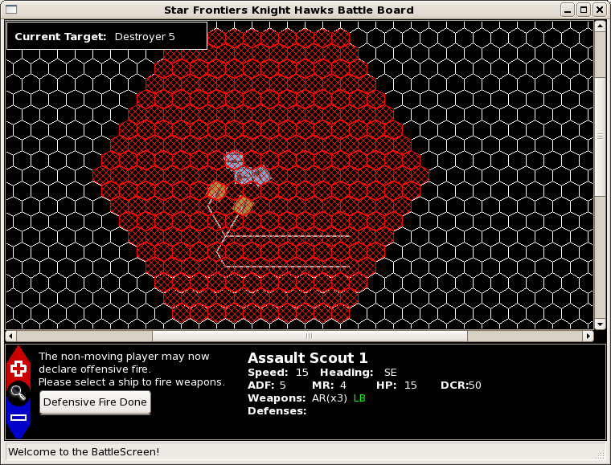
*Figure 26: Selecting a non-moving player weapon.  In this case, the Assault Scout's LB has been selected and all the hexes within its field of fire have been highlighted in red.  The selected target (the Sathar Destroyer) is displayed in the box in the upper left.*

To select a weapon, simply click on the weapon in the data display.  Doing so highlights the weapon's field of fire.  Any hex within range of the target is highlighted in red.  If you are firing a Forward Firing weapon, the hexes that fall within the “head on” bonus region are highlighted in blue.  If you are the non-moving player this round, it is simply the field of fire based on your current position as shown in figure 26.
If you are the moving player, the field of fire is determined based on the weapon's field of fire and the path the ship took.  Figure 27 gives an example of the field of fire for a moving weapon.
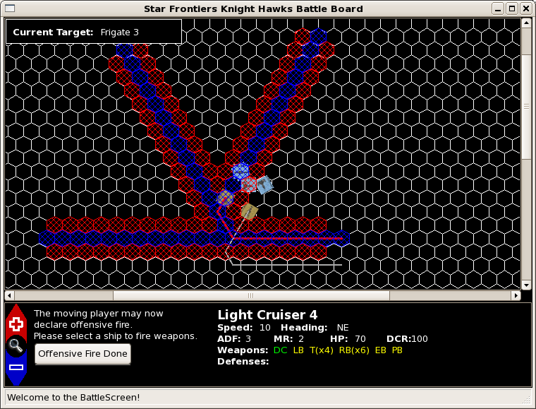
*Figure 27: Selecting a moving ship's weapon.  In this case the Sathar Light Cruiser's DC has been selected and all the hexes that were available as targets as it moved are highlighted.  The hexes that qualify for the 'head on shot' bonus are highlighted in blue.  Again the selected target is displayed in the upper left and the weapon's name has turned green indicating that it has a selected target.*

## Selecting defenses

During your movement turn you can change your active defense.  The defense list is shown in the data display area below the weapon list.  Defense names are color coded:

- green — currently active defense
- white — available, inactive
- orange — unavailable (power system damaged)
- red — damaged, cannot be used

To change your active defense, simply click on the defense you want.  Clicking on an already active defense will deactivate it, reverting to no defense.  Masking Screens have limited charges (2 per battle); each activation costs one charge.  A Masking Screen that is active will replace the ship's icon on the battle map with the Masking Screen icon.  ICMs are never activated from this list — the game automatically prompts you to allocate ICMs when an incoming weapon that can be intercepted is fired at your ship.

## Selecting targets
Once you've picked your weapon, it's time to pick your target.  To select a target simply click on the ship you want to shoot at.  If it is not a valid target it will not be selected.  If it is, the target vessel's name will be displayed in the target box in the upper left corner and the weapon's color will change to green if it was yellow (see figures 26 & 27).  If you want a different target, simply click on a different ship.  If there are more than one ship in the selected hex, clicking on the hex multiple times will cycle the target selection through all the ships in that hex.
The criteria for a ship being a valid target is different depending on whether you are the non-moving player or the moving player for that combat phase

- Non-moving player – If you are the non-moving player, a ship is a valid target if during any point of it's move, it passed through the field of fire for your weapon.  If the gray movement track does not pass through your field of fire and the ship's counter isn't there either, you can't shoot at it.  For example, in figure 26 the Assault Scout can fire its LB at either of the ships as their movement (as shown by the gray lines) passed through its field of fire.
- Moving player – If you  are the moving player, then the ship's icon has to fall within the illuminated hexes representing your field of fire for it to be a valid target.  If it isn't in one of the marked hexes, you can't shoot at it.  In figure 27, the Light cruiser can fire at the Frigate directly ahead of it (as well as the Assault Scout to the lower left of the Frigate) as those ships fall within it's field of fire.  The lead Assault Scout, however, is safe as the Light Cruiser's movement never brought it within the DC field of fire.
You don't have to worry about keeping track of “head on” shots for the forward firing weapons.  The program automatically checks the target vessel and determines the range to the target so as to give you the best possible chance to hit based on it's location in and out of your “head on” bonus areas.

## Taking the shot
You can continue to cycle through all of your ships and weapons selecting and changing targets until you are satisfied with your weapon allocations.  Once you are happy with your selections, click on the “Defensive Fire Done” or “Offensive Fire Done” button depending on which phase of the battle you are in.  Once you do, hit probabilities are rolled, damage is calculated and applied and any destroyed ships are removed from the game.
The “Offensive Fire Done” and “Defensive Fire Done” buttons are always active when they are displayed.  It is perfectly acceptable to end your combat turn without firing all of your weapons so be careful not to click them before you are ready as there is no going back.
Note:  The combat system implements the full Advanced Combat damage table from the Knight Hawks Tactical Operations Manual, including ADF/MR loss, weapon and defense critical hits, power system damage, navigation errors, electrical fires and more.  Defenses are fully active — Reflective Hulls, Masking Screens, Proton, Electron and Stasis Screens all modify to-hit rolls, and ICMs can be allocated to intercept incoming torpedoes and rocket batteries.

## Final tactical notes
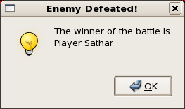

Play alternates back and forth between the two sides until all the ships from one side are destroyed.  At which point the game declares the other side the winner and the battle screen exits.  If you want to play again, just start it back up and try something different.

